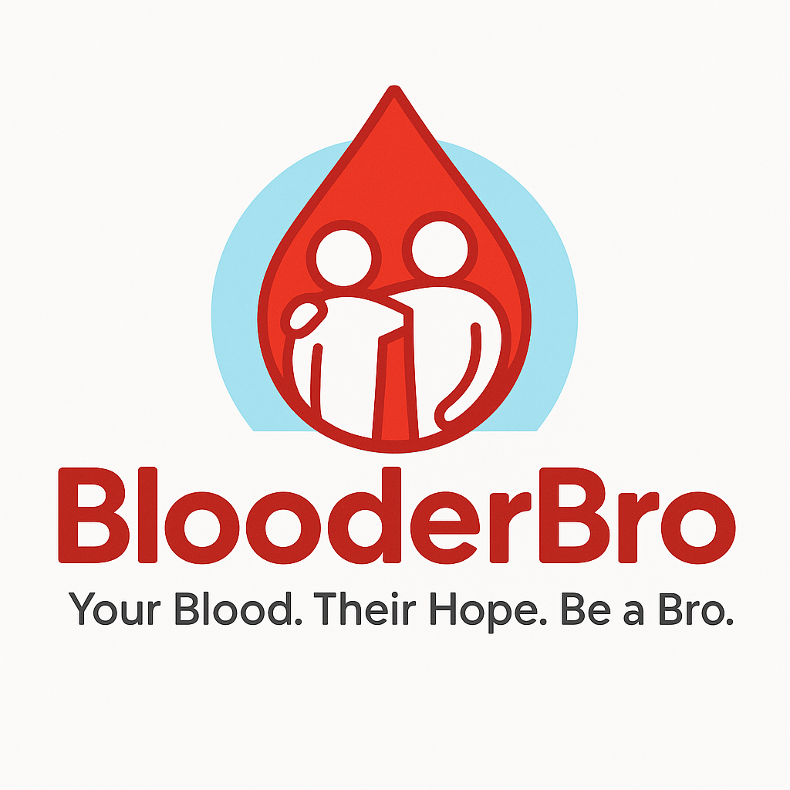

# 🩸 BlooderBro — Ours Local Blood Donation Community

<div align="center">



**Bridging the gap between patients in critical need and willing donors — in real time.**

[](https://nodejs.org/)
[](https://expressjs.com/)
[](https://www.mongodb.com/)
[](LICENSE)

[Features](#-key-features) · [Tech Stack](#️-tech-stack--architecture) · [Getting Started](#️-installation--local-setup) · [Contact](#-connect-with-blooderbro)

</div>

---

## 📖 Overview

**BlooderBro** is a localized, real-time blood donation platform that instantly connects patients in critical need with verified, willing donors in their exact area. Built with security-first principles, MVC architecture, and automated alerting — every minute saved could mean a life saved.

---

## 🚀 Key Features

| Feature | Description |
|---|---|
| 🎯 **Smart Local Matching** | Matches blood requests with eligible donors based on **Blood Group** and **Pincode** |
| 🚨 **Urgency Tiers** | Categorizes requests as *Emergency*, *Within 24 Hours*, or *Routine* |
| 📧 **Automated Email Alerts** | BCC-blasts matched donors instantly via `Nodemailer` when an emergency is posted |
| ✅ **Verified Lifesaver System** | Two-way verification — donors claim donation, requesters confirm it to award Lifesaving points |
| 📊 **Admin & Investor Dashboard** | Dynamic charts for 7-day request volume and 6-month cumulative user growth |
| 🛡️ **Security Shield** | Custom middleware blocking Postman, cURL, Insomnia & cross-site scripting |
| 🔐 **Secure Authentication** | `bcryptjs` password hashing, MongoDB-backed sessions, custom password-reset modal |

---

## 🛠️ Tech Stack & Architecture

> This project strictly follows the **MVC (Model-View-Controller)** pattern for extreme scalability and clean code separation.

### Frontend
- **EJS** (Embedded JavaScript Templates)
- **CSS3** (Flexbox Layouts) · **HTML5** · **Vanilla JavaScript**

### Backend
- **Node.js** · **Express.js**

### Database
- **MongoDB** (Mongoose ODM) · **MongoDB Atlas** (Cloud)

### Authentication & Security
- `express-session` · `connect-mongo` · `bcryptjs`

### Testing & Coverage
- **Mocha** · **Chai** · **Supertest** · **NYC** (Istanbul Code Coverage)

### Dev Tools
- **Nodemon** · **Dotenv**

---

## ⚙️ Installation & Local Setup

### Prerequisites
- Node.js `v18+`
- MongoDB Atlas account
- A Gmail account with an [App Password](https://support.google.com/accounts/answer/185833) enabled

### Steps

**1. Clone the repository**
```bash
git clone https://github.com/ArponRoy007/BlooderBro.git
cd BlooderBro
```

**2. Install dependencies**
```bash
npm install
```

**3. Configure environment variables**

Create a `.env` file in the root directory:
```env
PORT=3000
MONGO_URI=mongodb+srv://<your_atlas_user>:<your_atlas_password>@cluster0.mongodb.net/blooderbro?retryWrites=true&w=majority
SESSION_SECRET=your_super_secret_session_key
EMAIL_USER=your_official_email@gmail.com
EMAIL_PASS=your_google_app_password
```

**4. Start the development server**
```bash
npm run dev
```
The app will be live at `http://localhost:3000`

**5. Run the test suite** *(optional)*
```bash
npm test
```

---

## 🗂️ Project Structure

```
BlooderBro/
├── controllers/        # Route logic (MVC Controllers)
├── models/             # Mongoose schemas (MVC Models)
├── views/              # EJS templates (MVC Views)
├── routes/             # Express route definitions
├── middleware/         # Security shield & auth guards
├── public/             # Static assets (CSS, JS, images)
├── test/               # Mocha/Chai test suites
├── .env                # Environment variables (not committed)
├── app.js              # Express app entry point
└── package.json
```

---

## 👨‍💻 Developed By

<div align="center">

### **Arpon Roy**
*Full-Stack Developer*

[](https://www.linkedin.com/in/arpon-roy-60784a301)
[](https://github.com/ArponRoy007)
[](https://twitter.com/royarpon007)

</div>

> 💼 **Open to Work — Full-Stack Developer Roles & Internships**
>
> I'm actively seeking **full-time positions or internship opportunities** in Full-Stack or Backend Development. BlooderBro is a testament to my ability to independently architect, build, and ship a production-grade web application — complete with MVC design, real-time features, security systems, and automated testing.
>
> If your team values clean code, ownership, and developers who ship — I'd love to connect. Feel free to reach out via [LinkedIn](https://www.linkedin.com/in/arpon-roy-60784a301) or [Email](mailto:blooderbroofficial@gmail.com).

---

## 🌍 Connect with BlooderBro

Building a community of lifesavers. Reach out for partnerships, contributions, or investor relations.

<div align="center">

[](mailto:blooderbroofficial@gmail.com)
[](https://www.facebook.com/BlooderBroOfficial)
[](https://www.instagram.com/blooderbro.official/)

</div>

---

<div align="center">

*© 2026 BlooderBro. All rights reserved.*

</div>